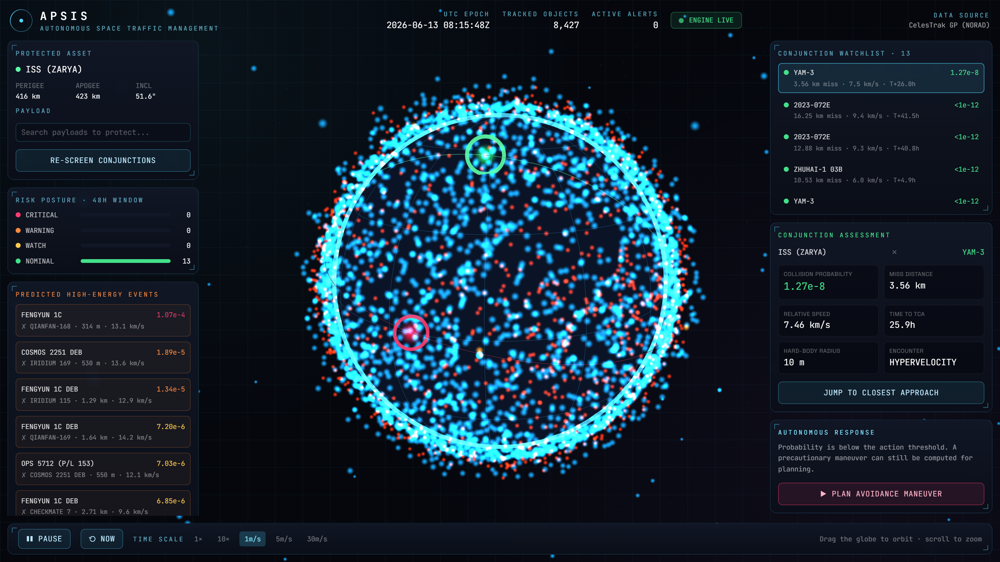

<div align="center">

# APSIS

### Autonomous Space Traffic Management

**Real-time conjunction screening · collision-probability assessment · autonomous avoidance-maneuver planning, on live NORAD data.**

[Theme: Space &amp; Aerospace](#) · [FAR AWAY 2026](#)



</div>

---

## The problem

There are more than 30,000 tracked objects in Earth orbit and millions of untracked
fragments. Three events alone, the 2007 Fengyun-1C anti-satellite test, the 2009
Iridium-33 / Cosmos-2251 collision, and the 2021 Cosmos-1408 ASAT test, created
thousands of debris fragments that are still crossing the busiest orbital shells at
14 km/s. Every fragment is a bullet, and the population is growing toward a chain
reaction (Kessler syndrome) that could make low Earth orbit unusable.

Operators currently react to conjunction alerts manually, hours in advance, with
analysts in the loop. That does not scale to mega-constellations of tens of thousands
of satellites. **Space traffic needs the equivalent of air traffic control, and it
needs to be autonomous.**

## What APSIS does

APSIS is a working space-traffic-management platform. It runs the full operational
pipeline on a real catalog:

1. **Ingest** a live NORAD/CelesTrak catalog (8,400+ real objects bundled, including
   the actual Fengyun-1C, Iridium-33, Cosmos-2251 and Cosmos-1408 debris clouds).
2. **Propagate** every object with SGP4/SDP4.
3. **Screen** a protected asset against the whole catalog, or run an all-pairs
   spatial-hash sieve across an entire orbital shell, to find close approaches.
4. **Assess** each close approach: time of closest approach, miss distance, and
   **collision probability** using Foster's 2D method, the same approach NASA CARA
   and ESA use operationally.
5. **Decide and act**: when probability crosses the action threshold, an optimizer
   computes the **minimum-propellant avoidance maneuver** that drives the probability
   back below the safe line, and explains the decision in plain language.
6. **Visualize** all of it on a real-time 3D mission-control globe.

Everything is computed from first principles in the browser. Nothing in the demo is
pre-rendered or faked, the conjunctions are real, found by re-running the screening
on live elements.

## Why this is hard to fake (and why the numbers are real)

- The orbital states come from **SGP4 on real TLEs**, validated against known orbits
  (the engine test suite checks the ISS orbit, energy/momentum conservation, and
  full-period closure to &lt; 5 cm).
- The collision probability is the **Foster 2D B-plane integral**, evaluated by
  direct polar quadrature, with a transparent, documented covariance model.
- The maneuver planner propagates the **actual post-burn trajectory** with a
  universal-variable two-body propagator and a differential-correction technique that
  anchors the result to SGP4 truth (see `lib/maneuver/optimizer.ts`).
- The featured events are produced by `scripts/find-events.ts`, which anyone can
  re-run to reproduce the exact conjunctions shown in the app.

A representative real result from the bundled catalog:

> **QIANFAN-168** (active satellite) × **FENGYUN 1C** debris, miss **0.31 km**,
> relative speed **13.1 km/s**, collision probability **1.07 × 10⁻⁴** (above the
> 1 × 10⁻⁴ action line). APSIS resolves it with a sub-m/s in-track burn.

## Architecture

```
┌──────────────────────────── Browser ────────────────────────────┐
│                                                                  │
│   React UI  ──state──►  Zustand store  ──messages──►  Engine     │
│   (Dashboard,                                          Web Worker│
│    3D Globe)  ◄─position buffers / results──────────────         │
│                                                                  │
│   3D Globe: Three.js, Earth, atmosphere shader, 8k-point        │
│   GPU cloud, orbit paths, live maneuver arc                      │
└──────────────────────────────────────────────────────────────────┘
                                  │
            lib/  (pure, tested astrodynamics, no UI deps)
   ┌──────────────┬───────────────┬──────────────┬─────────────────┐
   │ astro/       │ conjunction/  │ maneuver/    │ math/           │
   │ sgp4, kepler │ screening,    │ optimizer,   │ matrix          │
   │ frames, vec  │ probability,  │ rationale    │                 │
   │ catalog      │ covariance,   │              │                 │
   │              │ tca, sieve    │              │                 │
   └──────────────┴───────────────┴──────────────┴─────────────────┘
```

All heavy computation runs in a Web Worker, so the 3D view holds 60 fps while the
full catalog is propagated ~12 times per second and screening runs in the background.

### Key modules

| Module | Responsibility |
|--------|----------------|
| `lib/astro/sgp4.ts` | SGP4 propagation, orbit summaries, epoch handling |
| `lib/astro/kepler.ts` | Universal-variable two-body propagator (for post-burn arcs) |
| `lib/astro/frames.ts` | RIC/ECI frame transforms |
| `lib/conjunction/tca.ts` | Adaptive-step time-of-closest-approach search |
| `lib/conjunction/probability.ts` | Foster 2D collision probability |
| `lib/conjunction/covariance.ts` | Documented position-uncertainty model |
| `lib/conjunction/screening.ts` | Protected-asset-vs-catalog pipeline |
| `lib/conjunction/sieve.ts` | All-pairs spatial-hash conjunction sieve |
| `lib/maneuver/optimizer.ts` | Minimum-propellant avoidance planner + rationale |

## Run it

```bash
npm install
npm run dev          # http://localhost:3000
```

Then:

- The app opens on a live screening of the ISS. Drag to orbit the globe, scroll to zoom.
- Click an entry under **Predicted High-Energy Events** to load a real conjunction.
- Click **Plan Avoidance Maneuver** to watch the autonomous planner solve it; the cyan
  arc on the globe is the recomputed post-burn trajectory.
- Use **Run Global Scan** to screen the entire 700-900 km debris shell, all pairs.

### Other commands

```bash
npm test             # run the astrodynamics validation suite
npm run typecheck    # strict TypeScript check
npm run data:refresh # rebuild the catalog from live CelesTrak
node scripts/find-events.ts   # reproduce the featured conjunctions
node scripts/smoke.mjs        # headless end-to-end check + screenshots
```

## Tech

Next.js 15 · React 19 · TypeScript (strict) · Three.js · satellite.js (SGP4) ·
Zustand · Tailwind · Vitest. No backend required; deploys as a static/edge app.

## Hardware companion

`hardware/` contains the reference design for the **APSIS Ground Node**, a
GPS-disciplined 137/435 MHz receiver that observes real satellite passes and feeds
Doppler measurements back to refine orbit tracks, directly shrinking the covariance
the screening uses. Schematic, RF analysis (system noise figure ≈ 2.3 dB), link
budget, BOM, and netlist are included.

## Roadmap

- **Round 1 (now):** working platform, screening, probability, autonomous maneuver,
  3D ops view, validated engine.
- **Round 2:** operator-supplied covariance (CDM ingest), multi-asset fleet protection,
  maneuver scheduling against the full conjunction set, ground-node PCB layout + gerbers.
- **Round 3:** continuous OD from a ground-node mesh, constellation-scale autonomy,
  and a maneuver de-confliction layer so thousands of assets do not avoid into each other.

## Honesty notes

- TLE/GP data carries no covariance, so APSIS uses a documented, age-growing
  uncertainty model (`covariance.ts`). It is an explicit, replaceable assumption, shown
  in the UI, not a hidden fudge. Operator covariance drops straight in.
- Hard-body radii are per-class envelopes (published dimensions are not in the catalog).
- The two-body post-burn propagation is used only for the short maneuver arc and is
  differenced against SGP4 to cancel model error to first order.

---

<div align="center">
Built for FAR AWAY 2026 · Space &amp; Aerospace
</div>
